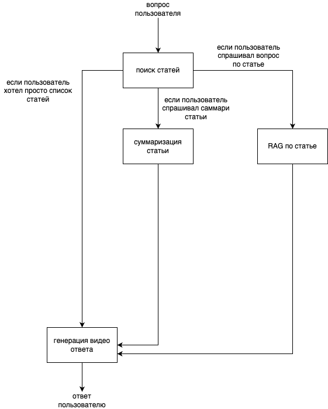
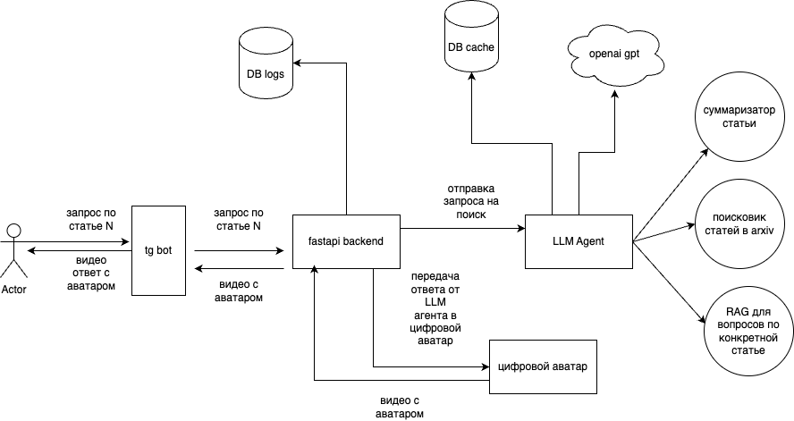

# ML System Design Doc
## Дизайн ML системы сервиса Margo

Margo - интеллектуальный ассистент-исследователь с интерактивным цифровым аватаром для поиска и объяснения информации в диалоговой форме. Ассистент позволяет:
- искать статьи/видео по интересующей тематике в интернете
- загружать свои статьи/видео во внутреннюю базу данных
- давать краткое саммари по статьям/видео
- отвечать на вопросы по конкретной статье/видео
- сохранять историю вопросов
- выгружать отчеты по истории взаимодействия с пользователем, включая информацию о запросах, ответах и другой связанной активности. Отчеты формируются в удобном формате для анализа и хранения.
- персонализировать цифрового аватара под свои нужды(настраивать внешний вид, стиль речи, манеру объяснения)

### 1. Цели и предпосылки
#### 1.1. Зачем идем в разработку продукта?

- Бизнес-цель:
  - Создать ассистента-исследователя, который будет ускорять изучение новой для пользователя информации и представлять ее в удобной форме через интерактивного аватара.
- Почему станет лучше, чем сейчас, от использования ML
  - Аватар упростит взаимодействие с информацией, снижая когнитивную нагрузку пользователя.
  - Персонализация позволит пользователям получать адаптированные ответы.
  - Использование машинного обучения позволит лучше понимать статьи и выделять ключевые моменты из видео в контексте. Это позволит увеличить скорость получения новой информации для пользователя - ему не придется читать все статьи или смотреть видео целиком.
  - 
- Что будем считать успехом итерации с точки зрения бизнеса
  - Реализация MVP с цифровым аватаром, который может суммаризировать статьи и отвечать по ним на вопросы. Цифровой аватар на данном этапе будет единым для всех пользователей без возможности персонализации и представлять собой сгенерированное видео с анимированной иллюстрацией персонажа аниме [Курису Макисэ](https://steins-gate.fandom.com/ru/wiki/%D0%9C%D0%B0%D0%BA%D0%B8%D1%81%D0%B5_%D0%9A%D1%83%D1%80%D0%B8%D1%81%D1%83), который озвучивает ответ на вопрос.

#### 1.2. Бизнес-требования и ограничения

- Краткое описание БТ и ссылки на детальные документы с бизнес-требованиями
  - Интерактивный аватар должен быть простым в использовании, поддерживать мультимодальные запросы (текст, голос) и иметь визуальный интерфейс.
  - Сервис должен поддерживать 8 основные функций:
    - Поиск информации(статьи/видео) в интернете
    - Возможность загрузки материалов пользователя во внутреннюю базу данных
    - Чтение и реферирование текстов
    - Суммаризация материала
    - Извлечение информации из видео (ключевые моменты).
    - Объяснение через видео визуализацию(цифрового аватара)
    - Возможность предоставлять отчеты, в том числе по истории взаимодействия с пользователем
    - Настройка цифрового интерактивного аватара под вкусы пользователя
- Бизнес-ограничения
  - Система должна уметь работать с русским языком
  - Система должна уметь работать в условиях ограниченных ресурсов(в идеале, без видеокарты, на конечном устройстве пользователя или по API)
  - Система должна иметь время отклика меньше 10 секунд
- Что мы ожидаем от конкретной итерации
  - MVP, которое работает на предобученных opensource моделях в открытом доступе(по API)
- Что считаем успешным пилотом? Критерии успеха и возможные пути развития проекта
  - Критерием успеха считаем появление MVP, тестирование на как минимум 30 пользователях и сборе положительной обратной связи(>=50%). Сбор обратной связи будет происходить путем подсчета лайков/дизлайков ответа на вопрос в telegram боте. При сборе обратной связи будет оцениваться только фактический ответ на вопрос, а не качество генерации видео.

#### 1.3. Что входит в скоуп проекта/итерации, что не входит

- На закрытие каких БТ подписываемся в данной итерации
  - В данной итерации подписываемся на:
    - Цифрового аватара в виде сгенерированное видео с анимированной иллюстрацией персонажа аниме
    - LLM агента с инструментами: поиск статей в интернете по свободному текстовому запросу, инструмент для суммаризации, RAG

- Что не будет закрыто: поиск информации по видео, VQA, подбор нейросетевых моделей для задачи и их валидация на тестовых данных, сбор тестовых датасетов для валидации нейросетевых моделей
- Описание результата с точки зрения качества кода и воспроизводимости решения:
  - Репозиторий с модульной структурой (код + тесты).
  - Настроенные CI/CD процессы
  - Описания экспериментов по подбору открытых opensource моделей
- Описание планируемого технического долга (что оставляем для дальнейшей продуктивизации)
  - Доработка аватара в режиме взаимодействия c пользователем realtime
  - Возможность для пользователя задать вопрос голосом
  - Настройка цифрового интерактивного аватара под запросы пользователя(настройка внешности, голоса, манеры объяснять)
  - Возможность загрузки данных пользователя во внутреннюю базу данных

#### 1.4. Предпосылки решения
Для создания системы учитываем следюущие предпосылки:
- Используемые данные: используем только открытые интернет-источники в случае нативного поиска статей по запросу(arxiv, scholar, etc) или пользовательские данные в случае работы с данными пользователя
- Система должна уметь работать как минимум со сторонними открытыми API, дающими доступ к LLM
- Видео цифрового аватара должно быть приятным глазу
- Система должна уметь отвечать только по существу, на основе знаний по тем документам/статьям, которые в нее передали или которые были найдены по текстовому запросу пользователя в интернете

### 2. Методология

#### 2.1. Постановка задачи

Разрабатать систему, состоящую из 2 компонент:
- модуль для генерации видео цифрового аватара
- модуль с LLM агентом для поиска 

Модуль с LLM агентом в свою очередь состоит из:
- supervisor для выбора инструментов, которые нужны для ответа на вопрос
- RAG по найденному материалу при ответе на конкретный вопрос
- tool для поиска релевантных статей в интернете
- tool для суммаризации
- кэш для уже найденной информации

#### 2.2. Блок-схема решения

#### 2.3. Этапы решения задачи

Всего в данной задаче 2 вещи, которые подразумевают в себе ML - модуль с цифровым аватаром и модуль с LLM агентом. Модуль с LLM агентом в свою очередь содержит три компоненты, которые используют ML - RAG, суммаризация статьи и поиск статей с использованием тулзов(поиска в Arxiv, поиска в PapersWithCode). Все эти компоненты лучше рассмотреть по отдельности:

Компонента поиска модуля LLM  
- Этап 1: Подготовка данных  
Содержит загрузку вопроса пользователя и перефразирование его в форму, пригодную для поиска статей с помощью инструментов. На выходе - перефразированный вопрос пользователя.
- Этап 2: Поиск статей  
Содержит поиск статей по запросу пользователя с помощью инструментов поиска на Arxiv или PapersWithCode. На данном этапе может быть произведен выбор только одного из инструментов в случае, если второй на требудется. Например: пользователь просит найти ему статьи по теме N только на arxiv. На выходе - ссылка на статьи и абстракт из статьи.
- Этап 3: Валидация  
Предполагает оценку качества поиска статей по заданному пользователем вопросу. Считается как количество статей, прочитанных пользователем из результатов поиска по отношению ко всем найденным статьям. Этот этап будет использоваться для дальнейшего улучшения поиска.

Компонента RAG модуля LLM  
- Этап 1: Подготовка данных  
Содержит загрузку статьи, по которой у пользователя есть вопрос, предобработку текста статьи, разбиение ее на чанки согласно выбранному алгоритму, последующая векторизация и сохранение в векторную БД. На выходе - набор эмбеддингов чанков статьи.
*В качестве алгоритма разбиения на чанки может использоваться алгоритм семантического разбиения на чанки, разбиения на чанки с перекрытием по N символов и другие. Необходимо тестирование для выбора наилучшего алгоритма.
- Этап 2: Получение истории запросов пользователя  
Содержит получение истории вопросов пользователя. Будет извлекаться 3 самых последних запроса из истории. На выходе - 3 последних запроса в текстовой форме.
- Этап 3: Подготовка вопроса пользователя  
Содержит получение вопроса, и обогащение его контекстом на основе извлеченной истории запросов. На выход - обогащенный контекстом вопрос пользователя в текстовой форме.
*Пример обогащения контекста:
История запросов пользователя: '[Что такое attention, Покажи формулу attention, Принципы работы self-attention]'
Вопрос пользователя: А что такое матрица Q?
Обогащенный контекстом вопрос пользователя: Объясни, что такое матрица Q в механизме работы self-attention
- Этап 4: Подготовка вопроса пользователя  
Содержит получение вопроса с этапа 3, его предобработку, векторизацию и передачу в систему семантического поиска(на основе векторной БД из этапа 1) для получения чанков, которые отвечают на вопрос пользователя. Выход - эмбеддинг запроса пользователя.
*На данном этапе векторизуется только текст, без обработки картинок и таблиц.
- Этап 5: Семантический поиск  
Является поиском в системе семантического поиска чанков из статьи, которые отвечают на вопрос пользователя по выбранной метрике схожести. На выходе - набор чанков из статьи, которые отвечают на вопрос пользователя, отсортированные в порядке значимости, согласно выбранной метрике расстояния.
*В качестве метрики схожести может использоваться косинусное расстояние, эвклидово расстояние и другие. Необходимо тестирование для выбора наилучшей метрики.
- Этап 6: Получение ответа на вопрос пользователя  
Предполагает передачу семантически близких к вопросу пользователя чанков и вопроса пользователя в LLM модель и получение ответа. На выходе - итоговый ответ на вопрос пользователя.
- Этап 7: Получение обратной связи  
Предполагает оценку метрик [Answer Relevancy](https://docs.confident-ai.com/docs/metrics-answer-relevancy) и [Faithfulness](https://docs.confident-ai.com/docs/metrics-faithfulness) по каждому запросу пользователя и ответу компоненты. Дополнительно будут собираться логи работы компоненты в БД для последующей ручной оценки работы компоненты и формирования валидационной выборки.

Компонента суммаризации модуля LLM  
- Этап 1: Подготовка данных  
Содержит загрузку статьи, по которой пользователь хочет получить саммари, предобработку текста,  разбиение его на чанки согласно выбранному алгоритму. На выходе - набор чанков статьи.
*В качестве алгоритма разбиения на чанки может использоваться алгоритм семантического разбиения на чанки, разбиения на чанки с перекрытием по N символов и другие. Необходимо тестирование для выбора наилучшего алгоритма.
- Этап 2: Суммаризация  
Содержит алгоритм суммаризации map-reduce, в котором сначала происходит суммаризация чанков статьи, а затем последующую суммаризацию саммари чанков в одно саммари. На выходе - саммари по статье.
*Алгоритм суммаризации требует дальнейшего исследования и тестирование на предмет качества суммаризаций больших статей
- Этап 3: Получение обратной связи  
Предполагает оценку метрики [Summarization](https://docs.confident-ai.com/docs/metrics-summarization) по каждому запросу пользователя и ответу компоненты. Дополнительно будут собираться логи работы компоненты в БД для последующей ручной оценки работы компоненты и формирования валидационной выборки.

Модуль с цифровым аватаром  
- Этап 1. Подготовка аудио с ответом  
Содержит получение ответа на вопрос пользователя от модуля LLM агента и перевод его в аудио запись формата .mp3 или .wav на русском языке. На выход - аудиофайл с ответом от модуля с LLM агентом.
- Этап2. Генерация видео ответа  
Содержит генерацию видео по аудио и изображению цифрового аватара с помощью библиотеки SadTalker. На выход - видеофайл с говорящим цифровым аватаром и наложенной аудиодорожкой.
*Этот этап может поменяться на wav2lip + mediapipe
**Вместо ожидаемого изображения цифрового аватара может использоваться изображение живого человека(мало что работает с аниме)
***Валидации на данном этапе не предполагается

### 3. Подготовка пилота

#### 3.1. Способ оценки пилота
Для данного MVP можно в качестве оценки позволить только сбор обратной связи от пользователей системы. При этом при оценке будет оцениваться только полная работа модуля LLM агента. Модуль генерации цифрового аватара оцениваться не будет.
Критерии оценки:
- Количество пользователей: 30 человек
- Оценка качества: лайк/диздайк на полный ответ модуля LLM агента
- Инструменты сбора обратной связи: ручные опросы и интерфейс TG бота
Артефакт на данном этапе: набор отзывов от пользователей системы

#### 3.2. Что считаем успешным пилотом
Для того, чтобы признать пилот успешным, можно рассматривать следующие метрики:

Время на выполнение задачи по поиску и разбору статьи N - успешным считается снижение времени на 30%.
Количество ошибок - успешным считается ошибка в 1 ответе на 6 успешных ответов, или примерно 15% ошибок допустимо при работе с системой.
Доля пользователей, отказавшихся использовать систему во второй раз - успешным считаемся минимум 10% и ниже, которые вернулись к ручному поиску и разбору статей.
Количество положительной обратной связи - успешным считается достижение >=50% положительной обратной связи от пользователей

#### 3.3. Подготовка пилота
Подготовка пилота включает в себя следующие шаги:
1. Подготовка ресурсов  
Ограничение на LLM - можем использовать только API, которое будет либо условно бесплатное, либо его можно оплатить из России без использования посредников и иностранных банковских карт.  

2. Параметры пилота  
Ограничение по количеству людей: 30 человек
Ограничение по времени: 3 недели
Фокус на оценке ответов модуля с LLM агентом

3. Сбор и анализ логов работы системы  
Анализ ответов модуля с LLM агентом на вопросы пользователя, фиксация ошибочных ответов, требующих доработки.

4. Отчет  
Подготовка финального отчета с описанием степени достижения метрик успешного пилота и описание собранных логов

### 4. Внедрение 

Для внедрения система будет развернута в соответствии с требованиями, которые предполагают масштабированность, и быстрый отклик. 
#### 4.1. Архитектура решения

Архитектурно будет представлено 6 компонент:
- модуль для генерации видео цифрового аватара 
- TG бот
- модуль с LLM агентом для поиска 
- модуль с fastapi, который будет оркестрировать модуль с LLM агентом и модуль с генерацией видео цифрового аватара
- база данных с кешом найденных материалов
- база данных запросов пользователя

*В виду технической сложности проекта в MVP реализованы только модули tg бота, модуля с LLM агентом и модуль backend для общения с модулем c LLM агентом

#### 4.2. Описание инфраструктуры и масштабируемости
- Какая инфраструктура выбрана и почему  
Инфраструктура решения предполагает использование контейниризации и оркестрации для обеспечения надежности и масштабируемости. В качестве инструментов будут использоваться k8s, Docker.
Для доступа к LLM будут использоваться облачные решения, так как обеспечить разворот локальной LLM пока не предоставляется возможным. Выбор зависит от стоимости доступа к апи и от качества работы. MVP будет использовать gpt-4o-mini.

- Плюсы и минусы выбора

  Плюсы:  
  - гибкость разработки
  - удобство масштабирования
  - возможность не разворачивать локальную LLM для работы MVP

  Минусы:  
  - зависимость от облачного провайдера для доступа к LLM моделям. Может потребоваться прокси или VPN, также у них могут быть сбой работы сервиса, на который мы не сможем повлиять.

Финальный выбор лучше альтернатив, так как он обеспечивает быструю разработку и возможность дешево протестировать MVP и получить фидбек пользователей

#### 4.3. Требования к работе системы

Отказоустойчивость: Система спроектирована с использованием многоуровневого резервирования и механизмов оперативного восстановления, что позволяет минимизировать время простоя и обеспечивать непрерывность работы даже в случае непредвиденных сбоев.

Отклик: Решение оптимизировано для предоставления ответов в пределах ~7 миллисекунд. Это позволяет обеспечивать быструю реакцию на вопросы пользователей.

SLA: Система обеспечивает доступность на уровне 99.99%, с гарантированным временем восстановления (RTO) не более 5 минут и максимальным допустимым временем потери данных (RPO) не превышающим 1 минуту.

#### 4.4. Безопасность системы

- Система может выдавать небезопасные генерации или ответы с генерациями, которые могут навредить пользователю

#### 4.5. Безопасность данных

- Шифрование данных:

Все данные, передаваемые между Telegram и сервером, защищены встроенным Telegram API.
Дополнительно можно шифровать пользовательские запросы на стороне сервера (например, для логирования).
- Управление доступом:

Лимит запросов на пользователя (Rate Limiting) для предотвращения злоупотребления ботом.  
Аутентификация пользователей через токены или интеграция с системой Telegram Login.
- Антифрод меры:

Анализ запросов: Проверка на подозрительные паттерны (например, флуд, запросы, похожие на SQL-инъекции или другие атаки).  
Блокировка пользователей: Временные или постоянные баны за нарушение правил.  
Фильтрация контента: Проверка, что модель не генерирует вредоносный или запрещенный контент (например, вводить валидацию ответов).  
- Защита от утечек:

Фильтрация ответов, чтобы модель не возвращала конфиденциальную информацию.  
Ограничение хранения истории запросов (или анонимизация данных).

#### 4.6. Издержки

Интеракции с внешними сервисами:  
Стоимость взаимодействия с внешними платформами или API, если система использует сторонние сервисы для обработки данных. Зависит от объемов запросов и от стоимости запроса к конкретной LLM модели .

#### 4.5. Integration points

TG bot взаимодействует с backend  
Backend взаимодействует с модулем LLM агента  
LLM агент использует несколько компонент - модуль для суммаризации, модуль для ответов на вопросы по статье, модуль для поиска статей  
Найденные и скаченные статьи логируются в базу кэша, чтобы не скачивать их по несколько раз  
Вопросы пользователя и ответы логируются в базу данных логов

#### 4.6. Риски

Рост нагрузки: При увеличении числа пользователей система может столкнуться с проблемами производительности.

Периоды высокой активности: В моменты пикового использования система может быть подвержена перегрузкам.

Зависимость от данных: Точность и релевантность предоставляемых ответов напрямую зависят от качества исходной информации, а также её объема.
